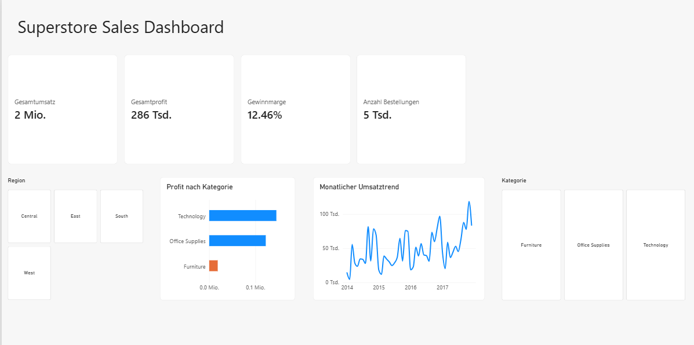

# Superstore Sales Analysis

Analyse der Umsatz- und Profitabilität eines US-Einzelhändlers mit Python, SQL und Power BI. 
Ziel: unprofitable Segmente identifizieren und konkrete Massnahmen ableiten.

## Geschäftsfragen
- Welche Produktkategorien sind am profitabelsten, welche verlieren Geld?
- Wie wirken sich Rabatte auf den Profit aus?
- Wie unterscheiden sich die Regionen?
- Wie entwickelt sich der Umsatz über die Zeit?

## Wichtigste Erkenntnisse
- **Furniture ist trotz $742K Umsatz kaum profitabel:** Gesamtmarge 2.5% gegenüber 17% bei 
  Technology und Office Supplies. Haupttreiber sind Tables (−$17'733) und Bookcases (−$3'479).
- **Rabatte kippen den Profit:** Positionen mit Rabatt machen im Schnitt $105 Verlust, 
  ohne Rabatt $42 Gewinn (922 von 9'993 Positionen).
- **Central ist die schwächste Region:** 7.9% Gesamtmarge gegenüber 14.9% in West.
- **Umsatz ist nicht Profit:** Der umsatzstärkste Kunde (Sean Miller, $25'042) 
  erzeugt einen Verlust von $1'981.
- Im Umsatztrend sind wiederkehrende Spitzen im Herbst/Winter sichtbar, 
  bei insgesamt steigender Tendenz von 2014 bis 2017.

## Handlungsempfehlungen
1. Preisgestaltung und Rabatte im Bereich Tables/Bookcases überprüfen.
2. Rabatte gezielter einsetzen, z.B. nur in margenstarken Kategorien.
3. Ursachen für die geringe Marge in Central untersuchen.
4. Kunden nach Profit statt nur nach Umsatz priorisieren.

## Vorgehen & Tools
| Schritt | Tool |
|---|---|
| Datenprüfung, Bereinigung, Analyse | Python (Pandas, Matplotlib) |
| Abfragen (GROUP BY, HAVING, CASE) | SQL (SQLite) |
| Interaktives Dashboard | Power BI (KPI-Karten, Slicer, DAX-Measure) |

## Datenqualität
Der Datensatz ist laut Kaggle bereits bereinigt. Meine Prüfung bestätigte: keine Duplikate, 
keine fehlenden Werte. Gefunden habe ich eine Zeile mit `sales = 0`, die bei der 
Margenberechnung zu einem unendlichen Wert führte. Sie wurde ausgeschlossen (9'993 Zeilen verbleiben).
Zudem unterscheide ich zwischen Produktzeilen (9'993) und eindeutigen Bestellungen (5'009).

## Projektstruktur
- `notebook/` – Analyse in Python (Jupyter Notebook)
- `sql/` – SQL-Abfragen
- `powerbi/` – Power-BI-Datei
- `data/` – Datensatz
- `images/` – Screenshots

## Datenquelle
[Superstore Sales Dataset auf Kaggle] https://www.kaggle.com/datasets/shumailazubair/superstore-sales-dataset-cleaned-for-sql-and-powerbi?select=superstore_sales.csv

## Hinweis zu den Projekten
Bei der Code-Erstellung habe ich unterstützend KI-Tools (Claude) genutzt – 
etwa für Syntax-Hilfe und Debugging. Fragestellung, Analyseentscheidungen 
und Interpretation der Ergebnisse stammen von mir.

## Kontakt
P. Tharunnya · p.tharunnya@gmail.com
